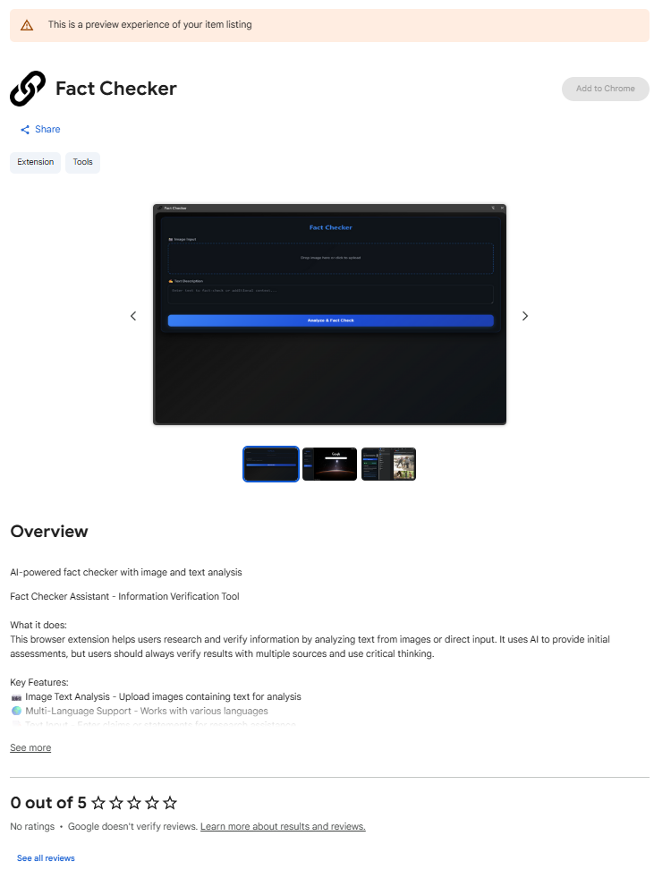

# AI Fact-Checker Server
<div align="center">

</div>


## What Makes This Special?

Welcome to the **AI Fact-Checker Server** - a cutting-edge backend service that harnesses the power of Google's Gemini 2.5 Pro and Gemini 2.0 Flash models to combat misinformation in real-time. This isn't just another API; it's your digital truth detector!

### Core Superpowers

- **🧠 Multi-Modal AI Analysis**: Process both text descriptions and images using state-of-the-art Gemini models
- **🌍 Universal Language Support**: Automatic translation capabilities for global fact-checking
- **📸 Advanced Image Processing**: OCR text extraction and visual content transcription
- **🔍 Deep Fact Analysis**: Comprehensive verification with supporting evidence
- **⚡ Lightning Fast**: Optimized for real-time fact-checking operations
- **🐳 Production Ready**: Dockerized for seamless deployment

## How It Works

Our intelligent fact-checking pipeline operates in three sophisticated stages:

### 1. **Input Processing**
```
Text/Image → Language Detection → Translation (if needed) → Content Extraction
```

### 2. **AI Analysis**
```
Content → Gemini 2.5 Pro → Fact Verification → Evidence Gathering → Credibility Assessment
```

### 3. **Smart Response**
```
Analysis → Structured JSON → Confidence Scores → Supporting Sources → Final Verdict
```

## Tech Stack

| Component | Technology | Purpose |
|-----------|------------|---------|
| **API Framework** | FastAPI | High-performance async API |
| **AI Engine** | Google Gemini 2.5 Pro | Advanced fact-checking analysis |
| **Vision AI** | Gemini 2.0 Flash | Image transcription & OCR |
| **Translation** | Google Translate API | Multi-language support |
| **Image Processing** | Pillow | Image optimization |
| **Deployment** | Docker + Cloud Run | Scalable containerization |

## API Endpoints

### `/fact-check` (POST)
The heart of our fact-checking engine!

**Parameters:**
- `description` (optional): Text to fact-check (max 1000 chars)
- `file` (optional): Image file for visual fact-checking
- `language` (optional): Source language for OCR (default: "English")

**Example Request:**
```bash
curl -X POST "http://localhost:8080/fact-check" \
  -F "description=The moon is made of cheese" \
  -F "language=English"
```

**Example Response:**
```json
{
  "result": {
    "claim_analysis": "Scientific evidence contradicts this claim...",
    "credibility_score": 0.1,
    "supporting_evidence": [...],
    "verdict": "FALSE"
  }
}
```

## Quick Start

### Prerequisites
- Python 3.10+
- Google Cloud credentials
- Gemini API key

### 1. Clone & Setup
```bash
git clone <your-repo>
cd fact-checker-server
pip install -r requirements.txt
```

### 2. Environment Configuration
Create a `.env` file:
```env
GEMINI_API_KEY=your_gemini_api_key_here
GOOGLE_CREDENTIAL_JSON={"type": "service_account", ...}
PORT=8080
```

### 3. Launch 
```bash
python main.py
```

Visit `http://localhost:8080` to see your fact-checker in action!

### Docker Deployment
```bash
docker build -t fact-checker-server .
docker run -p 8080:8080 --env-file .env fact-checker-server
```

## Chrome Extension Integration

> **🔥 Exciting News!** Our Chrome extension frontend is currently under review by Google and will be available on the Chrome Web Store soon! 

The extension will provide:
- ✨ One-click fact-checking for any webpage
- 🎯 Real-time misinformation detection
- 📱 Seamless browser integration
- 🔔 Instant credibility alerts

**Status:** *Under Google Review* - Stay tuned for the official release! (will update here soon...)

## Configuration

### Environment Variables
| Variable | Description | Required |
|----------|-------------|----------|
| `GEMINI_API_KEY` | Your Google Gemini API key | ✅ |
| `GOOGLE_CREDENTIAL_JSON` | Google Cloud service account JSON | ✅ |
| `PORT` | Server port (default: 8080) | ❌ |

### Supported Image Formats
- PNG, JPEG, JPG, GIF, BMP, WEBP
- Max file size: 10MB
- Auto-conversion to optimized RGB format

## Contributing

We welcome contributions! Whether it's bug fixes, feature enhancements, or documentation improvements:

---

<div align="center">

**Built with ❤️ for a more informed world**

*Fight misinformation, one fact at a time* 🌍✨

</div>